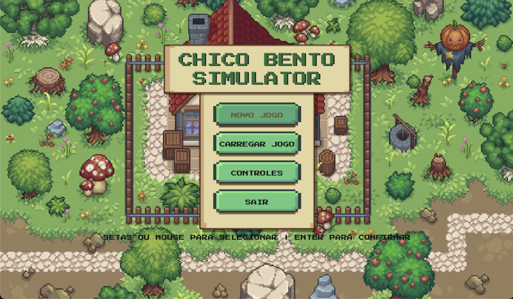
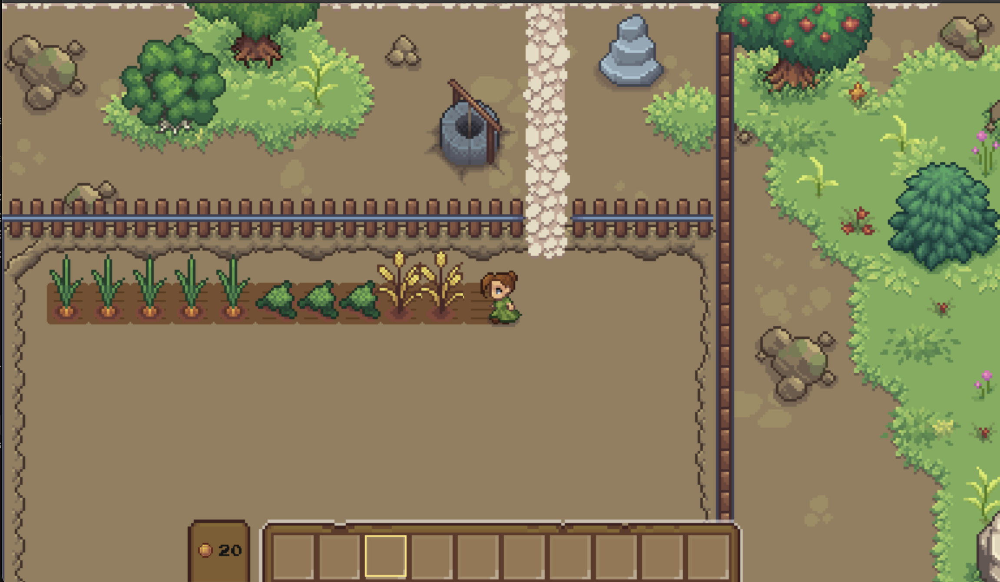
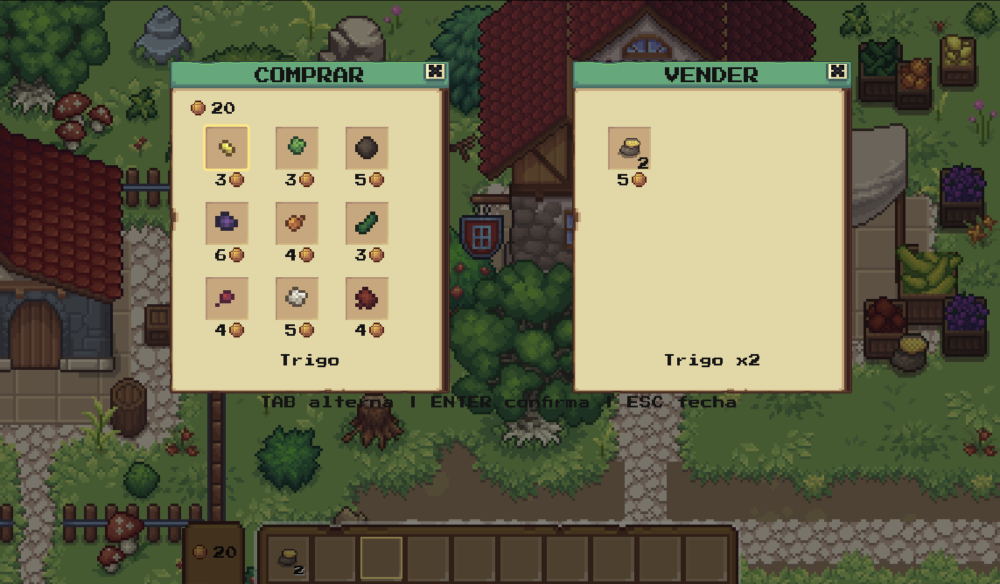
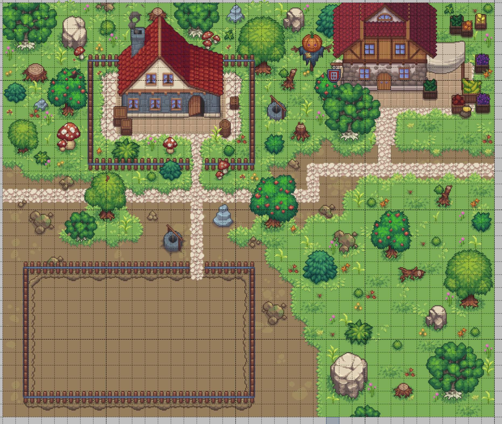

# Chico Bento Simulator 🌾


Um jogo de simulação de fazenda desenvolvido em Python com Pygame. Gerencie sua própria horta, plante sementes, colha vegetais frescos e negocie seus produtos na vendinha local.


*Captura do menu inicial*

*Captura da area de plantio*

*Captura da loja*

*Captura da area total do jogo no Tiled*

## 🎮 Funcionalidades

- **Sistema de Plantação**: Prepare a terra, plante sementes e acompanhe o crescimento das suas plantações.
- **Ciclo de Cultivo**: Diferentes sementes levam tempos variados para crescer e têm valores diferentes.
- **Inventário**: Gerencie suas sementes e colheitas em um inventário de fácil acesso.
- **Loja Interativa**: Compre sementes variadas e venda seus produtos para lucrar.
- **Economia**: Comece com pouco dinheiro e expanda seus negócios agrícolas.
- **Menus e Interface**: Pause o jogo, visualize controles e gerencie suas ações através de uma interface intuitiva.

## 🛠️ Tecnologias Utilizadas

- **Linguagem**: Python 3.x
- **Biblioteca Gráfica**: Pygame 2.6.1
- **Gerenciamento de Mapas**: Tiled (arquivos .tmx)

## 📋 Pré-requisitos

Certifique-se de ter o Python instalado em sua máquina.

## 🚀 Como Executar

1. **Clone o repositório**
   ```bash
   git clone https://github.com/seu-usuario/chico-bento-simulator.git
   cd chico-bento-simulator
   ```

2. **Crie e ative um ambiente virtual (recomendado)**
   
   *No Windows:*
   ```bash
   python -m venv .venv
   .venv\Scripts\activate
   ```
   
   *No macOS/Linux:*
   ```bash
   python3 -m venv .venv
   source .venv/bin/activate
   ```

3. **Instale as dependências**
   ```bash
   pip install -r requirements.txt
   ```

4. **Inicie o jogo**
   ```bash
   python main.py
   ```

## 🕹️ Controles

| Tecla | Ação |
|-------|------|
| **W, A, S, D** ou **Setas** | Movimentar o personagem |
| **E** ou **Espaço** | Interagir (Plantar, Colher, Abrir Loja) |
| **1 - 0** | Selecionar item no inventário |
| **ESC** | Pausar o jogo / Voltar |
| **Mouse** | Navegar nos menus |

## 📁 Estrutura do Projeto

```
chico-bento-simulator/
├── assets/          # Sprites, fontes, mapas e sons
├── src/             # Código fonte do jogo
│   ├── core/        # Gerenciamento principal e loop do jogo
│   ├── data/        # Dados estáticos (ex: tipos de plantação)
│   ├── entities/    # Entidades como Player
│   ├── states/      # Estados do jogo (Menu, Jogo, Pause)
│   ├── systems/     # Sistemas lógicos (Inventário)
│   ├── ui/          # Classes de interface do usuário
│   ├── utils/       # Ferramentas auxiliares
│   └── world/       # Gerenciamento do mundo e jardim
├── main.py          # Ponto de entrada
├── settings.py      # Configurações globais
└── requirements.txt # Dependências do projeto
```

## 🤝 Contribuição

Sinta-se à vontade para fazer um fork do projeto, abrir issues e enviar pull requests.

## 📝 Licença

Este projeto está sob a licença [MIT](LICENSE).

---
Desenvolvido para a disciplina de Linguagem de Programação Aplicada - Uninter.

<br>

---

# Chico Bento Simulator 🌾 (English Version)

A farm simulation game developed in Python with Pygame. Manage your own vegetable garden, plant seeds, harvest fresh vegetables, and trade your produce at the local market.

## 🎮 Features

- **Planting System**: Prepare the soil, plant seeds, and monitor the growth of your crops.
- **Crop Cycle**: Different seeds take varying times to grow and have different values.
- **Inventory**: Manage your seeds and harvests in an easily accessible inventory.
- **Interactive Shop**: Buy a variety of seeds and sell your produce for profit.
- **Economy**: Start with a little money and expand your agricultural business.
- **Menus and Interface**: Pause the game, view controls, and manage your actions through an intuitive interface.

## 🛠️ Technologies Used

- **Language**: Python 3.x
- **Graphics Library**: Pygame 2.6.1
- **Map Management**: Tiled (.tmx files)

## 📋 Prerequisites

Ensure you have Python installed on your machine.

## 🚀 How to Run

1. **Clone the repository**
   ```bash
   git clone https://github.com/your-username/chico-bento-simulator.git
   cd chico-bento-simulator
   ```

2. **Create and activate a virtual environment (recommended)**
   
   *On Windows:*
   ```bash
   python -m venv .venv
   .venv\Scripts\activate
   ```
   
   *On macOS/Linux:*
   ```bash
   python3 -m venv .venv
   source .venv/bin/activate
   ```

3. **Install dependencies**
   ```bash
   pip install -r requirements.txt
   ```

4. **Start the game**
   ```bash
   python main.py
   ```

## 🕹️ Controls

| Key | Action |
|-------|------|
| **W, A, S, D** or **Arrows** | Move character |
| **E** or **Space** | Interact (Plant, Harvest, Open Shop) |
| **1 - 0** | Select item in inventory |
| **ESC** | Pause game / Back |
| **Mouse** | Navigate menus |

## 📁 Project Structure

```
chico-bento-simulator/
├── assets/          # Sprites, fonts, maps, and sounds
├── src/             # Game source code
│   ├── core/        # Main management and game loop
│   ├── data/        # Static data (e.g., crop types)
│   ├── entities/    # Entities like Player
│   ├── states/      # Game states (Menu, Game, Pause)
│   ├── systems/     # Logic systems (Inventory)
│   ├── ui/          # User interface classes
│   ├── utils/       # Helper tools
│   └── world/       # World and garden management
├── main.py          # Entry point
├── settings.py      # Global settings
└── requirements.txt # Project dependencies
```

## 🤝 Contribution

Feel free to fork the project, open issues, and submit pull requests.

## 📝 License

This project is licensed under the [MIT](LICENSE) license.

---
Developed for the Applied Programming Language course - Uninter.
